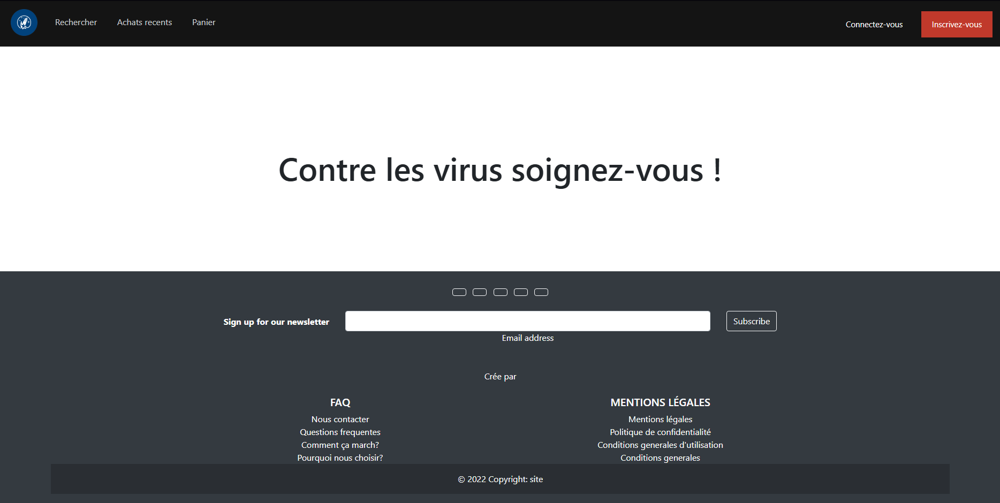

# 🛒 Django E-Shop

Projet e-commerce développé avec Django. Cette application permet aux utilisateurs de parcourir des produits, de les ajouter à un panier, de créer un compte et de passer commande.

> ⚠️ Ce projet a été réalisé à titre d'apprentissage et n'est pas conçu pour une utilisation en production sans amélioration de la sécurité (auth, permissions, CSRF, etc.).

---

## 🚀 Fonctionnalités

- 🛍️ Catalogue de produits avec images, prix, description
- 🛒 Système de panier (stocké en session)
- 👤 Création de compte et connexion utilisateur
- 📦 Page de validation de commande
- 📄 Interface d’administration Django
- 🌐 Templates HTML personnalisés

---

## 🛠️ Technologies utilisées

- Django 4.x
- Python 3
- JavaScript
- SQLite
- HTML / CSS (avec Bootstrap partiel)
- Django templating system

---

## 📷 Captures d'écran



---

## 📁 Structure du projet

```bash
.
├── eShop/              # Projet Django
│   ├── shop/           # App principale (produits, panier)
│   ├── users/          # App de gestion utilisateur
│   ├── templates/      # HTML templates
│   └── static/         # Fichiers statiques
└── db.sqlite3          # Base de données
